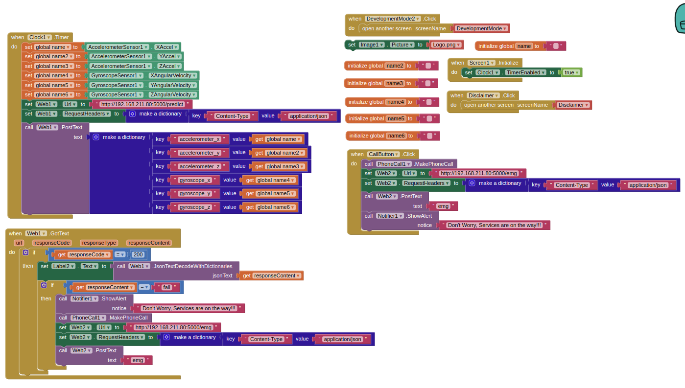
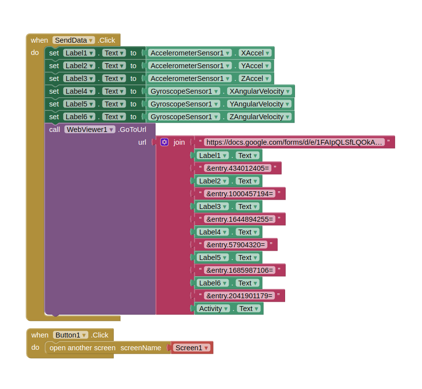

# Fall Detection System

## Overview
The Fall Detection System, **SecondGuardian**, is an application designed to detect falls using smartphone sensors such as an accelerometer and gyroscope. The system is trained using machine learning and can send emergency alerts via email when a fall is detected.

## Features
- **Real-time Fall Detection**: Uses a trained RandomForestClassifier to detect falls based on accelerometer and gyroscope readings.
- **REST API**: Built with Flask to expose endpoints for predictions and emergency alerts.
- **Email Alerts**: Sends an email to a predefined recipient when a fall is detected.
- **Pre-trained Model**: Uses `RandomForestClassifier` to classify sensor data as `fall` or `non-fall`.
- **Deployment Ready**: Can be run on a local or cloud server.

## Project Structure
```
.
├── .env                    # Environment variables (email credentials)
├── requirements.txt        # Dependencies
├── sensor_data.csv         # Sample dataset for training
├── train.py                # Model training script
├── testmail.py             # Email testing script
├── app.py                  # Flask application
└── README.md               # Project documentation
```


## Installation
### 1. Clone the repository
```sh
git clone https://github.com/kintsugi-programmer/UbiquitousComputingFallDetectML
cd UbiquitousComputingFallDetectML
```

### 2. Create and activate a virtual environment (optional but recommended)
```sh
python3 -m venv venv
source venv/bin/activate  # On Windows: venv\Scripts\activate
```

### 3. Install dependencies
```sh
pip install -r requirements.txt
```

### 4. Set up environment variables
Create a `.env` file with the following contents:
```ini
MAIL_USERNAME=your-email@example.com
MAIL_PASSWORD=your-email-password
MAIL_RECIPIENT=recipient-email@example.com
```

## Usage
### 1. Train the Model
Ensure `sensor_data.csv` exists in the root directory. Run the following command to train and save the model:
```sh
python train.py
```

### 2. Run the Flask App
```sh
python app.py
```
The application will start at `http://localhost:5000/`.

### 3. Test the API
#### a. Predict Fall Detection
Use a tool like Postman or `curl` to send a POST request:
```sh
curl -X POST http://localhost:5000/predict \
     -H "Content-Type: application/json" \
     -d '{
        "accelerometer_x": 1.0,
        "accelerometer_y": 7.9,
        "accelerometer_z": 6.8,
        "gyroscope_x": -0.2,
        "gyroscope_y": 1.9,
        "gyroscope_z": -1.3
     }'
```
**Response:**
```json
"fall" or "non-fall"
```

#### b. Send Emergency Alert
```sh
curl -X POST http://localhost:5000/emg
```
**Response:**
```json
{"success": "Emergency email sent successfully!"}
```

### 4. Test Email Configuration
Run the test email script:
```sh
python testmail.py
```

## Deployment
To deploy the application, use a cloud service like **Heroku, AWS, or GCP**. If using **Gunicorn**, run:
```sh
gunicorn --bind 0.0.0.0:5000 app:app
```

## Technologies Used
- **Python** (Flask, scikit-learn, pandas, NumPy, joblib)
- **Machine Learning** (RandomForestClassifier)
- **Email Notifications** (Flask-Mail, SMTP)
- **REST API** (Flask, FastAPI)

## Future Enhancements
- Extend model training with real-world sensor data.
- Deploy on a cloud service for wider accessibility.
- Add mobile app integration for live fall detection and notifications.

## License
This project is licensed under the MIT License. Feel free to use and modify as needed.


